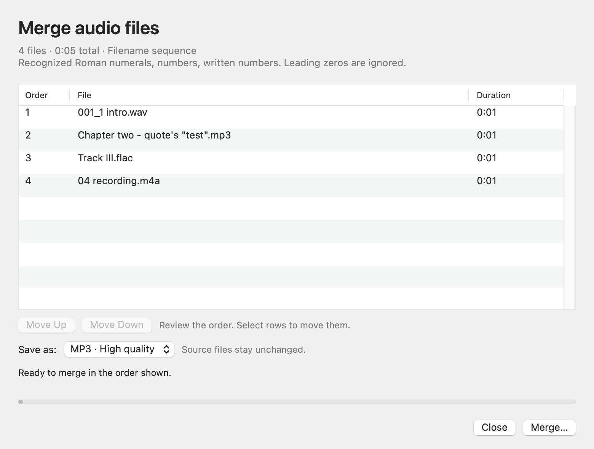

# Smart Audio Merge

A native macOS Finder Quick Action that merges audio files in numerical order.

Select your files, right-click, and choose **Quick Actions → Smart Audio Merge**. Review the detected order, adjust it if needed, then save one merged file. Processing stays on your Mac, and the original files remain unchanged.



## Install

Requirements:

- macOS, tested on macOS 15.6 with Apple silicon.
- A working Apple Clang toolchain from Xcode or Command Line Tools.
- Homebrew Python 3 and FFmpeg. The app checks the standard Apple silicon and Intel Homebrew locations.

With Homebrew already installed:

```sh
brew install python ffmpeg
git clone https://github.com/tario-you/smart-audio-merge.git
cd smart-audio-merge
./install.command
```

The installer compiles and locally signs the native app, installs it for your user, and registers the Finder Quick Action. It uses the existing developer toolchain. FFmpeg and Python remain separate runtime dependencies.

Installed files:

```text
~/Library/Application Support/Smart Audio Merge/Smart Audio Merge.app
~/Library/Services/Smart Audio Merge.workflow
```

## Use

1. Select at least two audio files in Finder.
2. Right-click and choose **Quick Actions → Smart Audio Merge**. The action is also available under **Services**.
3. Review the list. Select rows and use **Move Up** or **Move Down** to adjust the order.
4. Choose an output format, click **Merge…**, and choose a new destination filename.

MP3 is the default. M4A, FLAC, and WAV are also available. The completion view includes **Show in Finder**.

## How ordering works

| Filename style | Examples |
| --- | --- |
| Padded numbers | `1`, `01`, `001`, `010`, `100` |
| Compound sequences | `001_1`, `001_2`, `002_1` |
| Disc and track numbers | `Disc 1 Track 2`, `Disc 1 Track 10`, `Disc 2 Track 1` |
| English numbers | `Chapter one`, `Chapter twenty-one`, `Chapter one hundred` |
| Roman numerals | `Track I`, `Track IV`, `Track XCIX`, `Track C` |
| Numeric ISO dates | `2026-01-02`, `2026-02-01` |

Leading zeros are ignored. English numbers and Roman numerals are recognized at the beginning of a name or after labels such as `chapter`, `track`, `part`, and `disc`. Written numbers and Roman numerals are covered through 100.

If filenames lack a complete set of sequence numbers, complete embedded disc/track tags can provide the order. Remaining cases use natural filename sorting, with numbered files first. Repeated or missing numbers produce a review message.

Ordering is a filename and metadata heuristic. Review ambiguous titles before merging.

## Audio and file handling

- Reads the first audio stream from each selected file. WAV, MP3, FLAC, and M4A input combinations are tested; other audio formats depend on the installed FFmpeg build.
- Matching MP3 inputs saved as MP3 use a fast stream copy, preserving compressed audio without re-encoding. Sample rate and channel count must match. If copying reports an error or fails duration verification, the merge uses the conversion path.
- Other combinations decode each input sequentially and stream it into one encoder with bounded memory use.
- Adds no crossfades or volume adjustments. Existing silence is retained. MP3 stream copy retains per-track encoder padding, which can leave tiny gaps at joins; it is intended for chapter-style tracks rather than gapless music.
- Converts mixed sample rates to a common rate. Multichannel audio is mixed to stereo; all-mono input stays mono.
- Encodes MP3 with LAME quality 2, M4A with AAC at 256 kb/s, FLAC with a lossless codec, and WAV as 24-bit PCM.
- MP3 stream copy adds no lossy encoding generation. Converted MP3 and M4A add one lossy encoding generation. FLAC and WAV avoid additional lossy compression; sample-rate conversion, downmixing, and output bit depth still apply.
- Omits source tags, covers, and chapter markers from the merged output. Original files keep their metadata.
- Accepts a trailing tag, such as Lyrics3 or ID3v1, that the MP3 decoder reports as one damaged packet after the last audio frame. Each file is measured instead: a file that yields more than one percent less audio than its own duration stops the merge and is named in the message.
- Checks the output duration before publishing it with an atomic, exclusive rename. Existing destinations are preserved.
- Removes temporary output on cancellation or handled errors. No background service or login item is installed.

## Verify

Numbering tests use the Python standard library:

```sh
python3 -m unittest discover -s tests -v
```

The integration suite uses local FFmpeg and generated test tones:

```sh
python3 tests/integration.py
```

It verifies actual decoded segment order for mixed input formats and all four outputs, source-file hashes, existing-destination protection, an MP3 carrying a trailing Lyrics3 and ID3v1 tag, a materially short decode, invalid input, cancellation cleanup, and a 100-file merge. Each run stores its generated fixtures in a new ignored directory under `.test-artifacts/`.

Initial verification on macOS 15.6 included:

- All numbers from 1 through 100 in padded digits, English words, and Roman numerals.
- A 100-file merge producing 12.000 seconds, with every generated tone checked in numerical order.
- The installed Automator workflow launching the native app and producing a verified MP3.
- Manual reorder controls and offscreen visual inspection of preview, compact layout, and completion states.

Finder context-menu placement and the native save dialog were not clicked during automated verification. Other macOS versions and Intel Macs have not been tested.

## Source layout

```text
build_install.py       App build, signing, and Quick Action registration
install.command        Installer entry point
engine/ordering.py     Filename and metadata ordering
engine/audio.py        Probing, decoding, encoding, and output protection
engine/main.py         JSON command-line interface
native/                AppKit window and process bridge
tests/                 Ordering and real-audio integration checks
```

The engine also works from Terminal:

```sh
python3 engine/main.py plan -- 001.mp3 002.mp3
python3 engine/main.py merge --output merged.mp3 -- 001.mp3 002.mp3
```

Add `--keep-order` to `merge` to preserve the supplied argument order.
